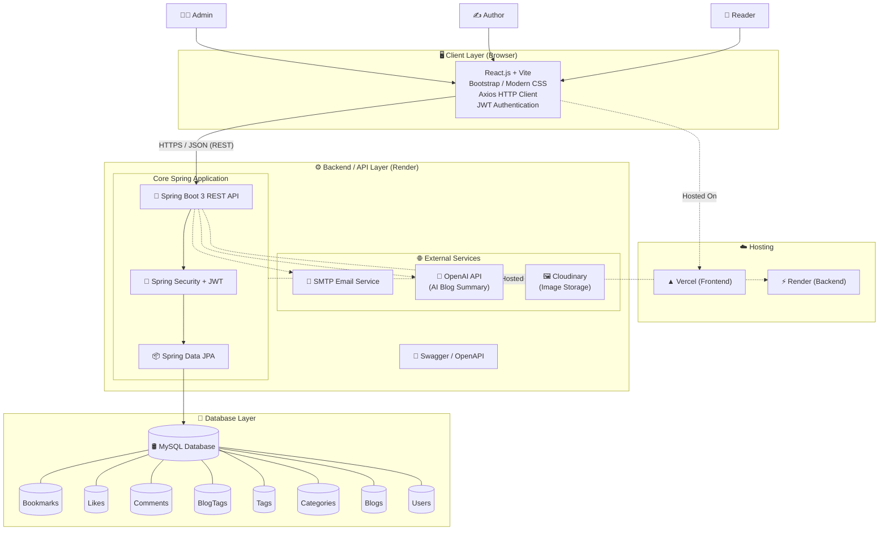
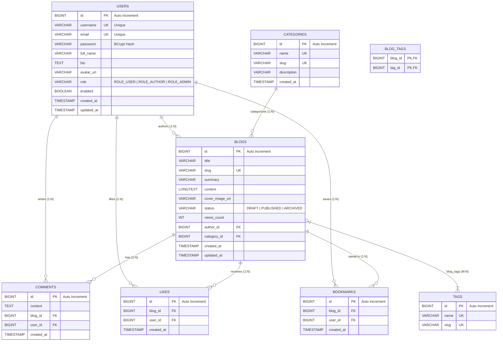

# 🎓 Blogging & Content Publishing Platform

[](https://www.oracle.com/java/)
[](https://spring.io/projects/spring-boot)
[](https://spring.io/projects/spring-security)
[](https://react.dev/)
[](https://vitejs.dev/)
[](https://www.mysql.com/)
[](https://render.com/)
[](https://vercel.com/)
[](LICENSE)

A modern, full-stack, enterprise-grade Blogging and Content Publishing Platform built using **Spring Boot 3 (Java 17)** backend and **React (Vite)** frontend. It streamlines digital content creation by featuring JWT-based security with Role-Based Access Control (RBAC), AI-powered blog summarization, interactive reader engagement (comments, likes, bookmarks), categorized content discovery, and comprehensive admin moderation tools.

---

## 🏛️ System Architecture

The application is architected around a decoupled, layered micro-monolith backend deployed on **Render** and a modern Single Page Application (SPA) frontend deployed on **Vercel**.



> 📖 *For in-depth architectural details and security flows, check the [System Architecture Guide](docs/architecture.md).*

---

## 🗄️ Database Entity-Relationship (ER) Diagram



> 📖 *For complete table schemas, SQL scripts, and data dictionaries, view [docs/er_diagram.md](docs/er_diagram.md) and [database/schema.sql](database/schema.sql).*

---

## 🚀 Key Features

- 🔐 **Authentication & Authorization**: Stateless JWT security with Role-Based Access Control (`ROLE_USER`, `ROLE_AUTHOR`, `ROLE_ADMIN`).
- 📝 **Content Management**: Rich Markdown / Text editor to compose, save drafts, preview, publish, edit, and archive articles.
- 🏷️ **Categorization & Multi-Tagging**: Organize articles into hierarchical categories and multi-tag taxonomy.
- 🤖 **AI Summary & Cloud Media**: OpenAI integration for automatic blog summaries and Cloudinary for image asset management.
- 💬 **User Engagement**: Interactive comments, post liking, and personal bookmarking reading list.
- 🔍 **Search & Discovery**: High-performance full-text search, topic filtering, and popular post recommendations.
- 🛡️ **Admin & Moderation Dashboards**: Administrative panel for user role management, post moderation, and publishing analytics.
- 🎨 **Modern Responsive UI**: Dark/Light mode support with glassmorphism UI tokens, micro-animations, and fluid layout.

---

## 🛠️ Tech Stack

### Backend
- **Language**: Java 17 (LTS)
- **Framework**: Spring Boot 3.x
- **Security**: Spring Security 6 with JWT
- **ORM / Persistence**: Spring Data JPA / Hibernate
- **Database**: MySQL 8.0 (Production) / H2 In-Memory (Dev/Test)
- **API Documentation**: OpenAPI 3.0 / Swagger UI
- **Build Tool**: Maven

### Frontend
- **Framework**: React 18 (Vite)
- **Routing**: React Router v6
- **HTTP Client**: Axios with JWT interceptors
- **Styling**: Bootstrap / Vanilla CSS (CSS Variables, Flexbox/Grid, Dark/Light theme)
- **State Management**: React Context API (`AuthContext`, `UserContext`)

### External Services & Hosting
- **Frontend Hosting**: Vercel
- **Backend Hosting**: Render
- **AI Blog Summarization**: OpenAI API
- **Media CDN**: Cloudinary
- **Notifications**: SMTP Email Service

---

## 📁 Directory Structure

```
blogging-content-platform/
├── .env.example
├── .gitignore
├── CHANGELOG.md
├── LICENSE
├── Problem_Statement.md
├── README.md
│
├── docs/
│   ├── api_endpoints.md                      # REST API Documentation
│   ├── architecture.md                       # System Architecture & Flow Specs
│   ├── er_diagram.md                         # Database Schema & ER Diagram Specs
│   └── requirements.md                       # Functional & Non-functional Specs
│
├── database/
│   ├── schema.sql                            # DDL Table Schemas & Constraints
│   └── sample_data.sql                       # Seed Data for Initial Setup
│
├── backend/                                  # Spring Boot REST API
│   ├── .env.example
│   ├── pom.xml                               # Maven Build Configuration
│   └── src/
│       ├── main/
│       │   ├── java/com/blog/platform/
│       │   │   ├── BloggingPlatformApplication.java
│       │   │   ├── config/                   # Security, CORS, Swagger Config
│       │   │   ├── controller/               # REST API Controllers
│       │   │   ├── dto/                      # Request & Response DTOs
│       │   │   ├── exception/                # Global Exception Handler
│       │   │   ├── model/
│       │   │   │   ├── entity/               # JPA Entities (User, Blog, etc.)
│       │   │   │   └── enums/                # Role, BlogStatus
│       │   │   ├── repository/               # Spring Data JPA Repositories
│       │   │   ├── service/                  # Business Logic Services
│       │   │   └── util/                     # JWT & File Utilities
│       │   │
│       │   └── resources/
│       │       ├── application.properties
│       │       ├── application-dev.properties
│       │       ├── application-prod.properties
│       │       └── data.sql
│       │
│       └── test/
│
└── frontend/                                 # React 18 + Vite SPA
    ├── .env.example
    ├── index.html
    ├── package.json
    ├── vite.config.js
    │
    ├── public/
    └── src/
        ├── api/                              # Axios API Clients
        ├── assets/                           # Static Assets & Icons
        ├── components/                       # Reusable UI Components
        ├── context/                          # AuthContext, UserContext
        ├── hooks/                            # Custom React Hooks
        ├── pages/                            # Application Views
        ├── routes/                           # Route Definitions
        ├── styles/                           # Global CSS & Design Tokens
        └── utils/                            # Helper Functions & Constants
```

---

## 🚀 Getting Started

### Prerequisites
- **JDK 17** or higher installed
- **Maven 3.8+** installed
- **Node.js 18+** and **npm** installed
- **MySQL 8.0+** (Optional for local development, H2 in-memory is active by default in dev mode)

---

### 1. Backend Setup

```bash
# Navigate to backend directory
cd backend

# Install dependencies and build
mvn clean install

# Run the Spring Boot application
mvn spring-boot:run
```

- Backend API: `http://localhost:8080/api/v1`
- Swagger UI Documentation: `http://localhost:8080/swagger-ui.html`
- OpenAPI Specification: `http://localhost:8080/v3/api-docs`

---

### 2. Frontend Setup

```bash
# Navigate to frontend directory
cd frontend

# Install npm dependencies
npm install

# Start Vite development server
npm run dev
```

- Frontend Application: `http://localhost:5173`

---

## 📡 REST API Overview

| Method | Endpoint | Description | Access |
|---|---|---|---|
| `POST` | `/api/v1/auth/register` | Register new user account | Public |
| `POST` | `/api/v1/auth/login` | Authenticate & receive JWT token | Public |
| `GET` | `/api/v1/blogs` | Get paginated published blogs | Public |
| `GET` | `/api/v1/blogs/{slug}` | Get blog details by slug | Public |
| `POST` | `/api/v1/blogs` | Create a new blog post | Author / Admin |
| `PUT` | `/api/v1/blogs/{id}` | Update existing blog post | Author / Admin |
| `DELETE` | `/api/v1/blogs/{id}` | Delete blog post | Author / Admin |
| `GET` | `/api/v1/categories` | List all categories | Public |
| `POST` | `/api/v1/categories` | Create a new category | Admin |
| `GET` | `/api/v1/tags` | List all tags | Public |
| `POST` | `/api/v1/blogs/{id}/comments` | Add comment to a blog | Authenticated |
| `POST` | `/api/v1/blogs/{id}/like` | Toggle like status on a blog | Authenticated |
| `POST` | `/api/v1/blogs/{id}/bookmark` | Toggle bookmark on a blog | Authenticated |
| `GET` | `/api/v1/search` | Search articles by keyword/tag | Public |
| `GET` | `/api/v1/admin/stats` | View platform statistics & metrics | Admin |

> 📖 *For complete request and response schemas, see [docs/api_endpoints.md](docs/api_endpoints.md).*

---

## 📄 License
This project is open-source and available under the [MIT License](LICENSE).
