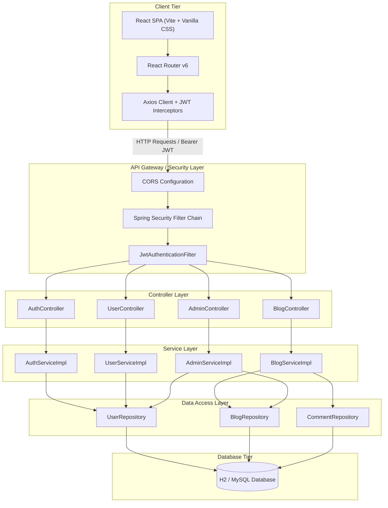
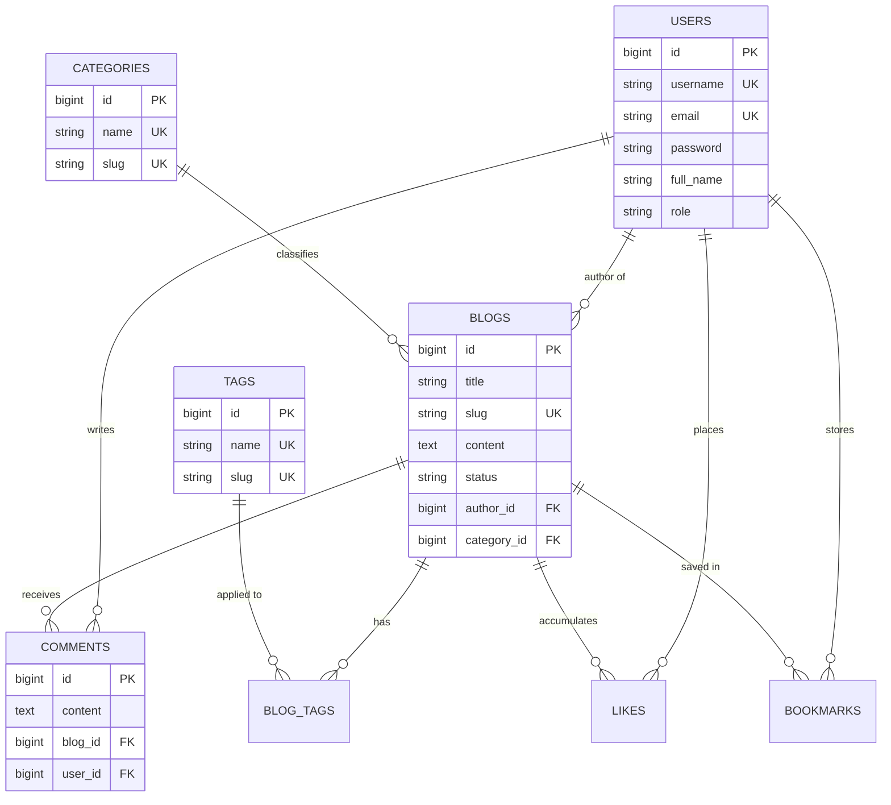
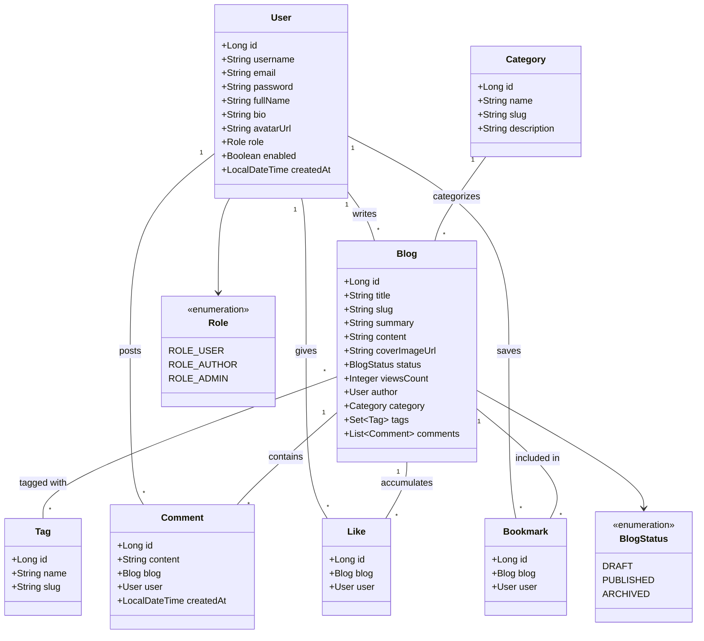

# 🎓 Blogging & Content Publishing Platform

A modern, full-stack, enterprise-grade Blogging and Content Publishing Platform built using **Spring Boot 3 (Java 17)** backend and **React (Vite)** frontend. It streamlines digital content creation by featuring JWT-based security with Role-Based Access Control (RBAC), interactive reader engagement (comments, likes, bookmarks), categorized content discovery, and comprehensive admin moderation tools.

---

## 🏗️ System Architecture Diagram



---

## 🗄️ Entity-Relationship (ER) Diagram



---

## 🏛️ Class Diagram



---

## 🚀 Key Features

- 🔐 **Authentication & Authorization**: Secure JWT-based authentication with Role-Based Access Control (`ROLE_USER`, `ROLE_AUTHOR`, `ROLE_ADMIN`).
- 📝 **Content Management**: Rich Markdown / Text editor to compose, save drafts, publish, edit, and delete blog posts.
- 🏷️ **Categorization & Multi-Tagging**: Organize articles into hierarchical categories and multi-tag taxonomy.
- 💬 **User Engagement**: Interactive comments, post liking, and personal bookmarking system.
- 🔍 **Search & Discovery**: High-performance full-text search, topic filtering, and popular post recommendations.
- 🛡️ **Admin & Moderation Dashboards**: Administrative panel for user role management, post moderation, and publishing analytics.
- 🎨 **Modern Responsive UI**: Dark/Light mode support with glassmorphism UI tokens, micro-animations, and fluid layout.

---

## 🛠️ Tech Stack

### Backend
- **Language**: Java 17
- **Framework**: Spring Boot 3.x
- **Security**: Spring Security 6 with JWT
- **Database**: H2 (In-memory for Dev) / MySQL 8.0 (Production)
- **ORM**: Spring Data JPA / Hibernate
- **Documentation**: OpenAPI 3.0 / Swagger UI
- **Build Tool**: Maven

### Frontend
- **Framework**: React 18 (Vite)
- **Routing**: React Router v6
- **HTTP Client**: Axios with JWT interceptors
- **Styling**: Vanilla CSS (CSS Variables, Flexbox/Grid, Glassmorphism, Micro-animations)
- **State Management**: React Context API

---

## 📁 Directory Structure

```
blogging-content-platform/
├── .env.example
├── .gitignore
├── CHANGELOG.md
├── LICENSE
├── Problem_Statement.md
├── README.md
│
├── docs/
│   ├── architecture_diagram.png
│   ├── class_diagram.png
│   ├── er_diagram.png
│   ├── schema.dbml                           # Source DBML schema for dbdiagram.io
│   ├── diagrams/
│   │   ├── architecture.md                   # System Architecture Documentation
│   │   ├── class_diagram.md                  # UML Class Diagram Documentation
│   │   ├── er_diagram.md                     # ER Diagram Documentation
│   │   └── schema.dbml
│   └── screenshots/
│       ├── login_page.png
│       ├── register_page.png
│       ├── home_page.png
│       ├── dashboard.png
│       ├── create_blog.png
│       ├── blog_details.png
│       └── admin_dashboard.png
│
├── database/
│   ├── schema.sql
│   ├── sample_data.sql
│   └── schema.dbml
│
├── backend/                                  # Java 17 + Spring Boot REST API
│   ├── .env.example
│   ├── pom.xml                               # Maven Build Configuration
│   └── src/
│       ├── main/
│       │   ├── java/com/bloggingplatform/
│       │   │   ├── BloggingPlatformApplication.java
│       │   │
│       │   │   ├── config/                   # Security & Configuration
│       │   │   │   ├── SecurityConfig.java
│       │   │   │   ├── JwtFilter.java
│       │   │   │   ├── JwtAuthenticationEntryPoint.java
│       │   │   │   ├── CorsConfig.java
│       │   │   │   └── SwaggerConfig.java
│       │   │
│       │   │   ├── controller/               # REST Controllers
│       │   │   │   ├── AuthController.java
│       │   │   │   ├── UserController.java
│       │   │   │   ├── BlogController.java
│       │   │   │   ├── CategoryController.java
│       │   │   │   ├── TagController.java
│       │   │   │   ├── CommentController.java
│       │   │   │   ├── LikeController.java
│       │   │   │   ├── BookmarkController.java
│       │   │   │   ├── SearchController.java
│       │   │   │   └── AdminController.java
│       │   │
│       │   │   ├── service/                  # Service Interfaces
│       │   │   │   ├── AuthService.java
│       │   │   │   ├── UserService.java
│       │   │   │   ├── BlogService.java
│       │   │   │   ├── CategoryService.java
│       │   │   │   ├── TagService.java
│       │   │   │   ├── BlogTagService.java
│       │   │   │   ├── CommentService.java
│       │   │   │   ├── LikeService.java
│       │   │   │   ├── BookmarkService.java
│       │   │   │   ├── SearchService.java
│       │   │   │   └── AdminService.java
│       │   │
│       │   │   ├── service/impl/             # Service Implementations
│       │   │   │   ├── AuthServiceImpl.java
│       │   │   │   ├── UserServiceImpl.java
│       │   │   │   ├── BlogServiceImpl.java
│       │   │   │   ├── CategoryServiceImpl.java
│       │   │   │   ├── TagServiceImpl.java
│       │   │   │   ├── BlogTagServiceImpl.java
│       │   │   │   ├── CommentServiceImpl.java
│       │   │   │   ├── LikeServiceImpl.java
│       │   │   │   ├── BookmarkServiceImpl.java
│       │   │   │   ├── SearchServiceImpl.java
│       │   │   │   └── AdminServiceImpl.java
│       │   │
│       │   │   ├── repository/               # Spring Data JPA Repositories
│       │   │   │   ├── UserRepository.java
│       │   │   │   ├── BlogRepository.java
│       │   │   │   ├── CategoryRepository.java
│       │   │   │   ├── TagRepository.java
│       │   │   │   ├── BlogTagRepository.java
│       │   │   │   ├── CommentRepository.java
│       │   │   │   ├── LikeRepository.java
│       │   │   │   └── BookmarkRepository.java
│       │   │
│       │   │   ├── model/
│       │   │   │   ├── entity/               # JPA Entities
│       │   │   │   │   ├── User.java
│       │   │   │   │   ├── Blog.java
│       │   │   │   │   ├── Category.java
│       │   │   │   │   ├── Tag.java
│       │   │   │   │   ├── BlogTag.java
│       │   │   │   │   ├── Comment.java
│       │   │   │   │   ├── Like.java
│       │   │   │   │   └── Bookmark.java
│       │   │   │   │
│       │   │   │   └── enums/
│       │   │   │       ├── Role.java
│       │   │   │       └── BlogStatus.java
│       │   │
│       │   │   ├── dto/                      # Request & Response DTOs
│       │   │   │   ├── LoginRequest.java
│       │   │   │   ├── LoginResponse.java
│       │   │   │   ├── RegisterRequest.java
│       │   │   │   ├── UserResponse.java
│       │   │   │   ├── BlogRequest.java
│       │   │   │   ├── BlogResponse.java
│       │   │   │   ├── CategoryRequest.java
│       │   │   │   ├── TagRequest.java
│       │   │   │   ├── CommentRequest.java
│       │   │   │   └── BookmarkResponse.java
│       │   │
│       │   │   ├── exception/                # Custom Exceptions
│       │   │   │   ├── ResourceNotFoundException.java
│       │   │   │   ├── UnauthorizedException.java
│       │   │   │   ├── DuplicateResourceException.java
│       │   │   │   └── GlobalExceptionHandler.java
│       │   │
│       │   │   └── util/                     # Utility Classes
│       │   │       ├── JwtUtil.java
│       │   │       ├── ValidationUtil.java
│       │   │       └── FileUploadUtil.java
│       │   │
│       │   └── resources/
│       │       ├── application.properties
│       │       ├── application-dev.properties
│       │       ├── application-prod.properties
│       │       ├── data.sql                  # Initial Seed Data
│       │       └── static/
│       │           └── uploads/
│       │               └── blog-images/
│       │
│       └── test/
│           └── java/com/bloggingplatform/
│               ├── BloggingPlatformApplicationTests.java
│               ├── BlogServiceTest.java
│               └── AuthControllerTest.java
│
└── frontend/                                 # React 18 + Vite Frontend
    ├── .env.example
    ├── index.html
    ├── package.json
    ├── vite.config.js
│
    ├── public/
    │   ├── logo.png
    │   ├── favicon.ico
    │   └── default-avatar.png
│
    └── src/
        ├── main.jsx
        ├── App.jsx
        ├── App.css
        ├── index.css
│
        ├── api/                              # Axios Services
        │   ├── axiosConfig.js
        │   ├── authApi.js
        │   ├── blogApi.js
        │   ├── categoryApi.js
        │   ├── commentApi.js
        │   ├── bookmarkApi.js
        │   └── likeApi.js
│
        ├── assets/
        │   ├── images/
        │   └── icons/
│
        ├── components/                       # Reusable Components
        │   ├── Navbar.jsx
        │   ├── Sidebar.jsx
        │   ├── Footer.jsx
        │   ├── BlogCard.jsx
        │   ├── SearchBar.jsx
        │   ├── CategoryCard.jsx
        │   ├── Loader.jsx
        │   ├── ProtectedRoute.jsx
        │   └── RichTextEditor.jsx
│
        ├── context/                          # React Context
        │   ├── AuthContext.jsx
        │   └── UserContext.jsx
│
        ├── hooks/
        │   ├── useAuth.js
        │   └── useFetch.js
│
        ├── pages/                            # Application Pages
        │   ├── Home.jsx
        │   ├── Login.jsx
        │   ├── Register.jsx
        │   ├── Dashboard.jsx
        │   ├── CreateBlog.jsx
        │   ├── EditBlog.jsx
        │   ├── BlogDetails.jsx
        │   ├── Categories.jsx
        │   ├── Search.jsx
        │   ├── Profile.jsx
        │   ├── Bookmarks.jsx
        │   ├── AdminDashboard.jsx
        │   ├── ManageBlogs.jsx
        │   ├── ManageUsers.jsx
        │   └── NotFound.jsx
│
        ├── routes/
        │   └── AppRoutes.jsx
│
        └── utils/
            ├── constants.js
            ├── helpers.js
            ├── validators.js
            └── storage.js
```

---

## 🚀 Getting Started

### Prerequisites
- JDK 17 or higher
- Maven 3.8+
- Node.js 18+ and npm

### 1. Backend Setup
```bash
cd backend
mvn clean install
mvn spring-boot:run
```
The backend API will start at `http://localhost:8080/api/v1`.  
Swagger UI will be available at `http://localhost:8080/swagger-ui.html`.

### 2. Frontend Setup
```bash
cd frontend
npm install
npm run dev
```
The frontend web application will start at `http://localhost:5173`.

---

## 📄 License
This project is open-source and available under the [MIT License](LICENSE).
