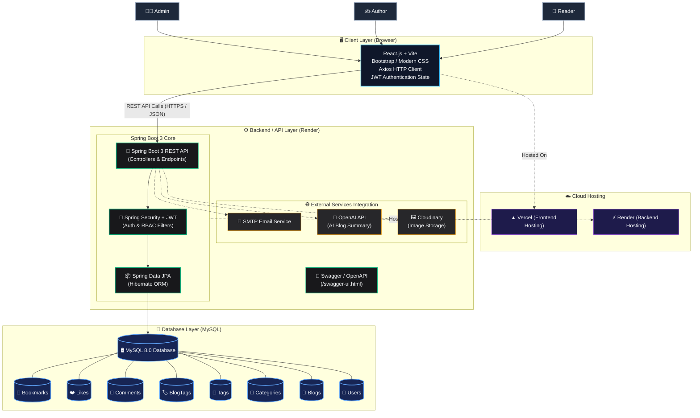

# 🏛️ System Architecture

This document describes the end-to-end architecture, technical design, and deployment topology of the **Blogging & Content Publishing Platform**.

---

## 📊 End-to-End System Architecture Diagram

---

## 🔍 Detailed Component Breakdown

### 1. 👥 User Roles (Actors)
- **Admin**: Oversees platform health, manages user roles and permissions, moderates published articles, and views platform analytics.
- **Author**: Creates, drafts, edits, formats, and publishes articles with tags and categories.
- **Reader**: Discovers content, searches topics, reads articles, leaves comments, likes posts, and saves bookmarks.

---

### 2. 🖥️ Client Layer (Browser)
- **Framework**: React 18 with Vite for blazing-fast development and optimized production bundles.
- **Design & Styling**: Modern responsive UI with CSS variables, Flexbox/Grid, and responsive typography.
- **Network / API**: Axios client with centralized interceptors that automatically attach JWT Bearer tokens to outgoing requests and handle token expiration (401).
- **Authentication**: Client-side authentication context holding user state, role claims, and token management in `localStorage`.
- **Hosting**: Deployed on **Vercel** with CDN edge caching and SSL automation.

---

### 3. ⚙️ Backend / API Layer (Render)
- **Spring Boot 3 REST API**:
  - Modular layered architecture: `Controller -> Service -> Repository -> Entity`.
  - Global Exception Handling via `@ControllerAdvice` providing consistent error formats.
  - Data Transfer Objects (DTOs) with validation constraints (`jakarta.validation`).
- **Spring Security + JWT**:
  - Stateless authentication mechanism via `JwtFilter`.
  - Role-Based Access Control (`ROLE_USER`, `ROLE_AUTHOR`, `ROLE_ADMIN`).
  - Password encryption using BCrypt (`PasswordEncoder`).
- **Spring Data JPA**:
  - Hibernate ORM with connection pooling (HikariCP).
  - Declarative queries and optimized fetch plans for relational data.
- **Swagger / OpenAPI**:
  - Interactive API documentation console at `/swagger-ui.html`.
  - Schema documentation at `/v3/api-docs`.

---

### 4. 🌐 External Services Integration
- **SMTP Email Service**: Sends user verification, password reset, and engagement notifications.
- **OpenAI API**: Automates AI-powered blog summarization, SEO description generation, and content enhancement.
- **Cloudinary Image Storage**: Cloud-based media CDN for uploading, optimizing, and delivering blog cover images and user avatars.

---

### 5. 💾 Database Layer
- **Relational Database**: **MySQL 8.0** with strict foreign key integrity, cascade rules, and composite indexes.
- **Tables**:
  1. `users` - User credentials, roles, profile metadata.
  2. `categories` - Hierarchical topic classifications.
  3. `blogs` - Articles with markdown content, slug, view counter, status (`DRAFT`, `PUBLISHED`).
  4. `tags` - Metadata tags for search taxonomy.
  5. `blog_tags` - Join table for Many-to-Many mapping between blogs and tags.
  6. `comments` - User comments associated with articles.
  7. `likes` - Unique user likes per blog.
  8. `bookmarks` - Saved reading lists per user.
