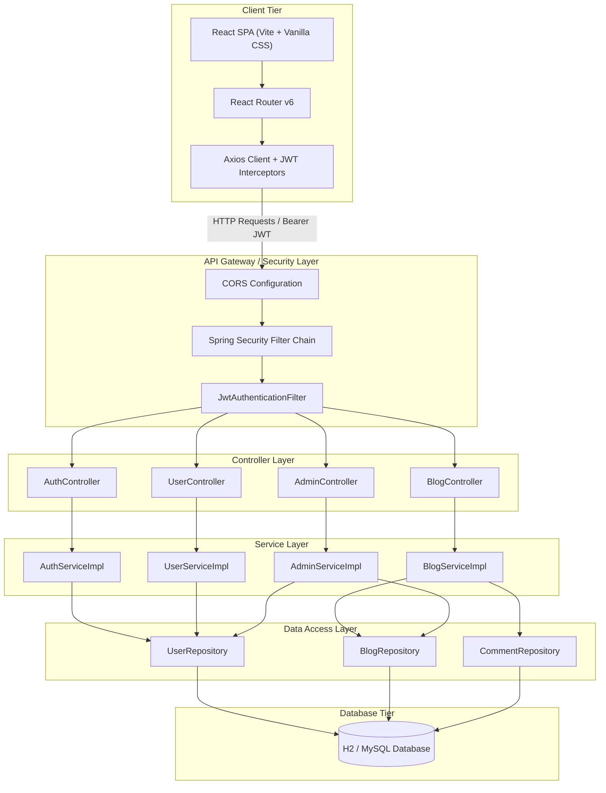

# Architecture Diagram

```mermaid
graph TD
    subgraph Client Tier
        UI["React SPA (Vite + Vanilla CSS)"]
        Router["React Router v6"]
        Axios["Axios Client + JWT Interceptors"]
    end

    subgraph API Gateway / Security Layer
        CORS["CORS Configuration"]
        SecFilter["Spring Security Filter Chain"]
        JWTFilter["JwtAuthenticationFilter"]
    end

    subgraph Controller Layer
        AuthCtrl["AuthController"]
        BlogCtrl["BlogController"]
        UserCtrl["UserController"]
        AdminCtrl["AdminController"]
    end

    subgraph Service Layer
        AuthSvc["AuthServiceImpl"]
        BlogSvc["BlogServiceImpl"]
        UserSvc["UserServiceImpl"]
        AdminSvc["AdminServiceImpl"]
    end

    subgraph Data Access Layer
        UserRepo["UserRepository"]
        BlogRepo["BlogRepository"]
        CommentRepo["CommentRepository"]
    end

    subgraph Database Tier
        DB[("H2 / MySQL Database")]
    end

    UI --> Router
    Router --> Axios
    Axios -->|HTTP Requests / Bearer JWT| CORS
    CORS --> SecFilter
    SecFilter --> JWTFilter
    JWTFilter --> AuthCtrl & BlogCtrl & UserCtrl & AdminCtrl

    AuthCtrl --> AuthSvc
    BlogCtrl --> BlogSvc
    UserCtrl --> UserSvc
    AdminCtrl --> AdminSvc

    AuthSvc --> UserRepo
    BlogSvc --> BlogRepo & CommentRepo
    UserSvc --> UserRepo
    AdminSvc --> UserRepo & BlogRepo

    UserRepo --> DB
    BlogRepo --> DB
    CommentRepo --> DB
```
