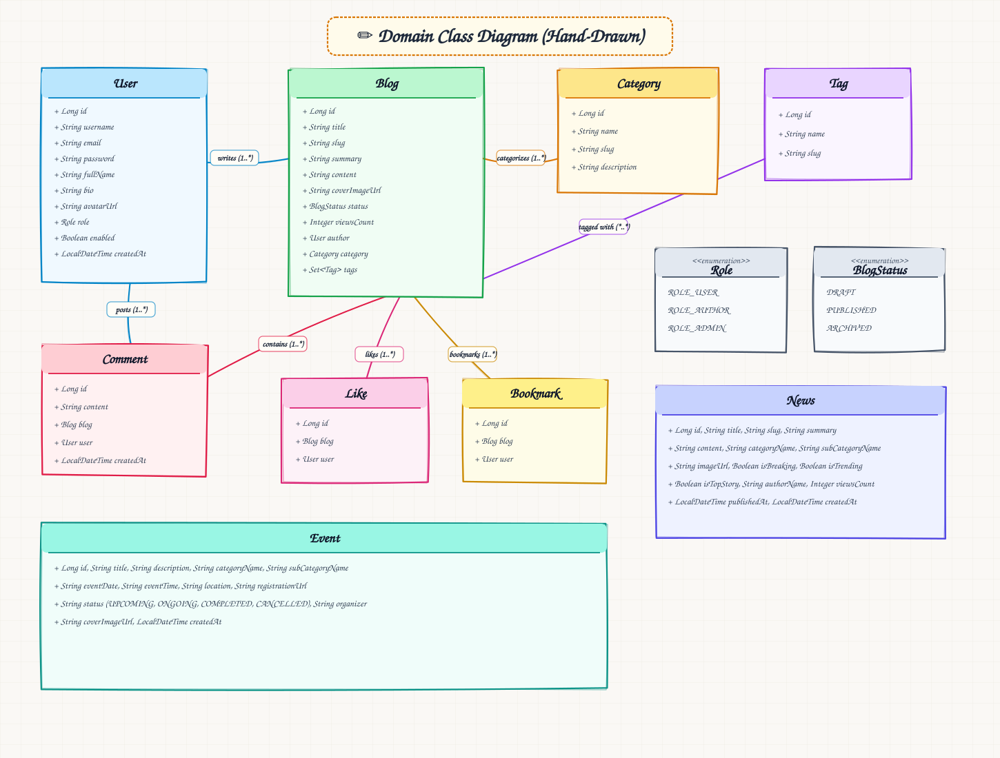
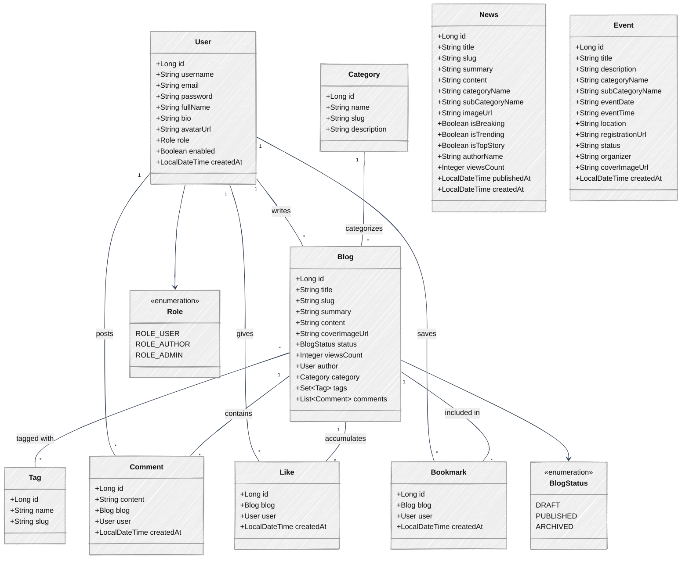

# Class Diagram (Human / Hand-Drawn Style)

> **Hand-Drawn Diagram View**: This domain model class diagram is styled with a hand-drawn human sketch aesthetic.

---

## Mermaid Class Diagram (Hand-Drawn Look)

---

## Domain Entity Overview

| Entity | Description | Key Relationships |
| :--- | :--- | :--- |
| **`User`** | System user with authentication credentials, roles, and profile details | Writes `Blog`, posts `Comment`, gives `Like`, saves `Bookmark` |
| **`Blog`** | Core publishing article/post entity | Belongs to `User` (author) and `Category`, has many `Tag`, `Comment`, `Like`, `Bookmark` |
| **`Category`** | Topic classification for blog posts | One-to-Many association with `Blog` |
| **`Tag`** | Label/keyword attached to posts | Many-to-Many association with `Blog` |
| **`Comment`** | User comment on a blog post | Belongs to `User` and `Blog` |
| **`Like`** | User appreciation vote for a blog post | Belongs to `User` and `Blog` (Unique per user/blog) |
| **`Bookmark`** | User saved post bookmark | Belongs to `User` and `Blog` (Unique per user/blog) |
| **`News`** | News announcement item | Includes trending, breaking, and category metadata |
| **`Event`** | Platform event / web event | Includes date, time, location, organizer, registration URL |

