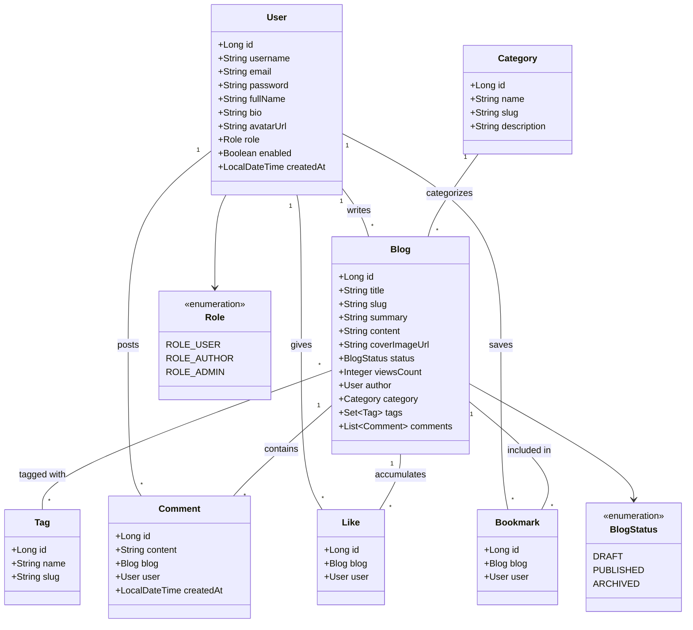

# Class Diagram

```mermaid
classDiagram
    class User {
        +Long id
        +String username
        +String email
        +String password
        +String fullName
        +String bio
        +String avatarUrl
        +Role role
        +Boolean enabled
        +LocalDateTime createdAt
    }

    class Blog {
        +Long id
        +String title
        +String slug
        +String summary
        +String content
        +String coverImageUrl
        +BlogStatus status
        +Integer viewsCount
        +User author
        +Category category
        +Set~Tag~ tags
        +List~Comment~ comments
    }

    class Category {
        +Long id
        +String name
        +String slug
        +String description
    }

    class Tag {
        +Long id
        +String name
        +String slug
    }

    class Comment {
        +Long id
        +String content
        +Blog blog
        +User user
        +LocalDateTime createdAt
    }

    class Like {
        +Long id
        +Blog blog
        +User user
    }

    class Bookmark {
        +Long id
        +Blog blog
        +User user
    }

    class Role {
        <<enumeration>>
        ROLE_USER
        ROLE_AUTHOR
        ROLE_ADMIN
    }

    class BlogStatus {
        <<enumeration>>
        DRAFT
        PUBLISHED
        ARCHIVED
    }

    User "1" -- "*" Blog : writes
    User "1" -- "*" Comment : posts
    User "1" -- "*" Like : gives
    User "1" -- "*" Bookmark : saves
    Category "1" -- "*" Blog : categorizes
    Blog "*" -- "*" Tag : tagged with
    Blog "1" -- "*" Comment : contains
    Blog "1" -- "*" Like : accumulates
    Blog "1" -- "*" Bookmark : included in
    User --> Role
    Blog --> BlogStatus
```
