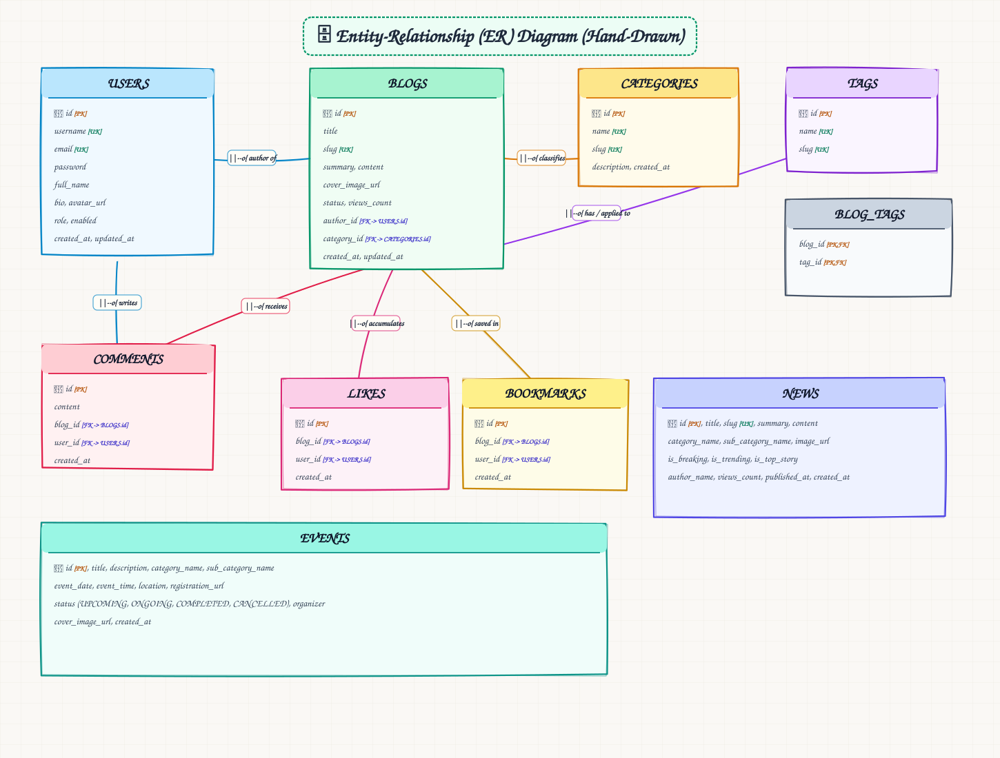
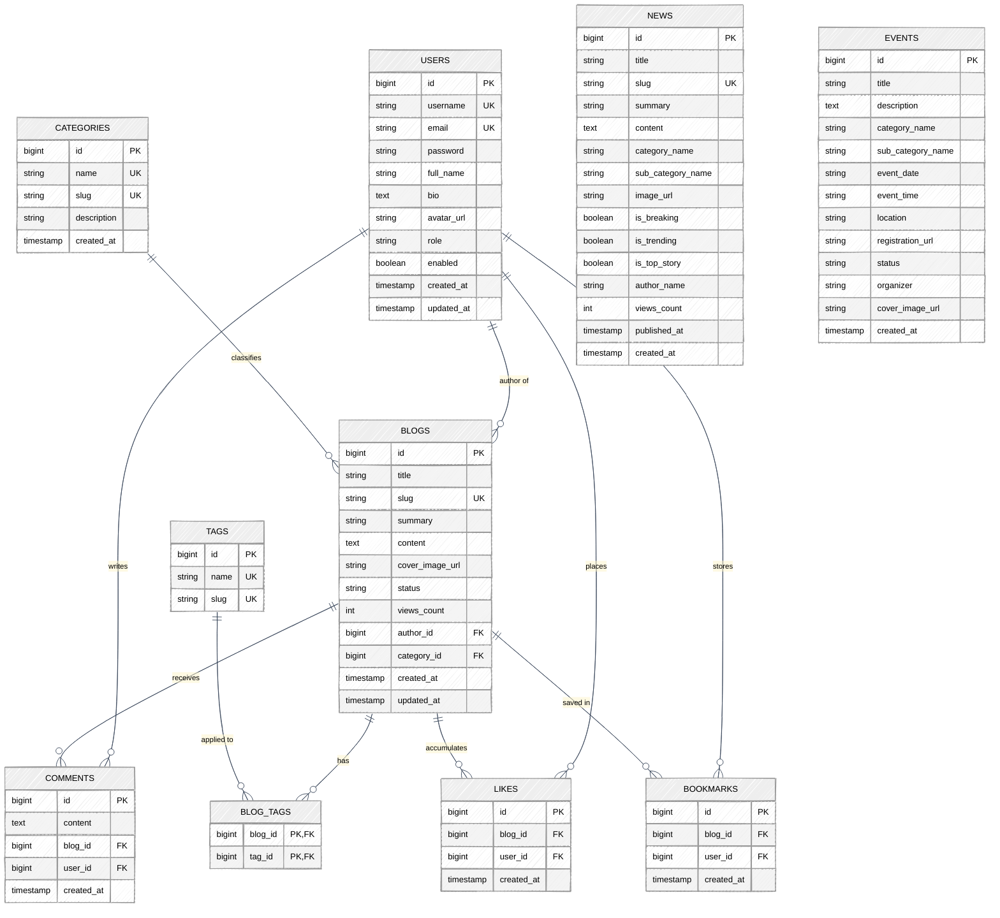

# Entity-Relationship (ER) Diagram (Human / Hand-Drawn Style)

> **Hand-Drawn Diagram View**: This relational database schema diagram is styled with a hand-drawn human sketch aesthetic.

---

## Mermaid ER Diagram (Hand-Drawn Look)

---

## Relational Database Tables Overview

| Table | Primary Key | Foreign Keys | Key Columns |
| :--- | :--- | :--- | :--- |
| **`USERS`** | `id` | - | `username` (UK), `email` (UK), `password`, `role`, `enabled` |
| **`CATEGORIES`** | `id` | - | `name` (UK), `slug` (UK), `description` |
| **`BLOGS`** | `id` | `author_id` &rarr; `USERS(id)`, `category_id` &rarr; `CATEGORIES(id)` | `title`, `slug` (UK), `content`, `status`, `views_count` |
| **`TAGS`** | `id` | - | `name` (UK), `slug` (UK) |
| **`BLOG_TAGS`** | `(blog_id, tag_id)` | `blog_id` &rarr; `BLOGS(id)`, `tag_id` &rarr; `TAGS(id)` | Join table for many-to-many relationship |
| **`COMMENTS`** | `id` | `blog_id` &rarr; `BLOGS(id)`, `user_id` &rarr; `USERS(id)` | `content`, `created_at` |
| **`LIKES`** | `id` | `blog_id` &rarr; `BLOGS(id)`, `user_id` &rarr; `USERS(id)` | Unique index `(blog_id, user_id)` |
| **`BOOKMARKS`** | `id` | `blog_id` &rarr; `BLOGS(id)`, `user_id` &rarr; `USERS(id)` | Unique index `(blog_id, user_id)` |
| **`NEWS`** | `id` | - | `title`, `slug` (UK), `summary`, `is_breaking`, `is_trending` |
| **`EVENTS`** | `id` | - | `title`, `event_date`, `location`, `status`, `registration_url` |

