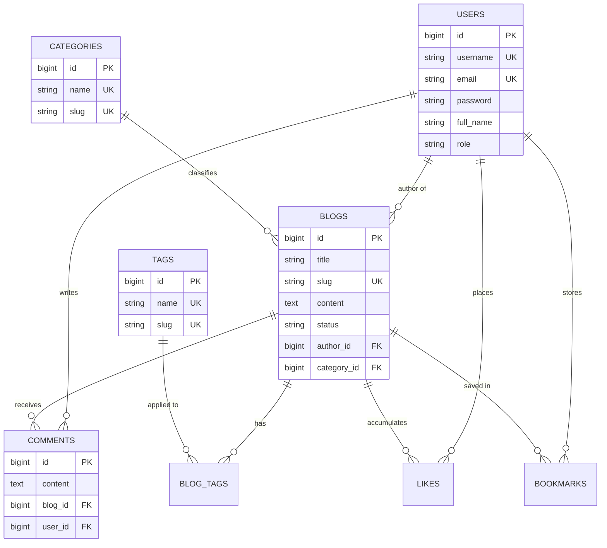

# Entity-Relationship (ER) Diagram

```mermaid
erDiagram
    USERS ||--o{ BLOGS : "author of"
    USERS ||--o{ COMMENTS : "writes"
    USERS ||--o{ LIKES : "places"
    USERS ||--o{ BOOKMARKS : "stores"

    CATEGORIES ||--o{ BLOGS : "classifies"

    BLOGS ||--o{ BLOG_TAGS : "has"
    TAGS ||--o{ BLOG_TAGS : "applied to"

    BLOGS ||--o{ COMMENTS : "receives"
    BLOGS ||--o{ LIKES : "accumulates"
    BLOGS ||--o{ BOOKMARKS : "saved in"

    USERS {
        bigint id PK
        string username UK
        string email UK
        string password
        string full_name
        string role
    }

    CATEGORIES {
        bigint id PK
        string name UK
        string slug UK
    }

    BLOGS {
        bigint id PK
        string title
        string slug UK
        text content
        string status
        bigint author_id FK
        bigint category_id FK
    }

    TAGS {
        bigint id PK
        string name UK
        string slug UK
    }

    COMMENTS {
        bigint id PK
        text content
        bigint blog_id FK
        bigint user_id FK
    }
```
