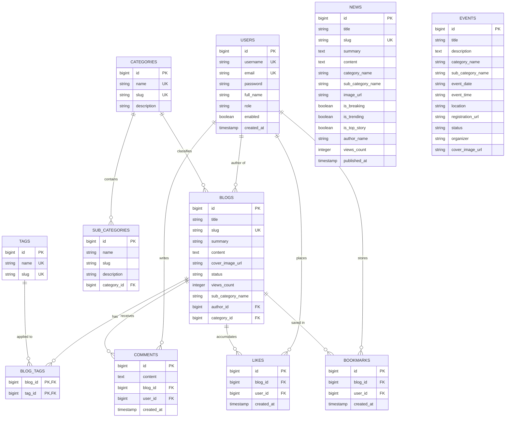

# Entity-Relationship (ER) Diagram

```mermaid
erDiagram
    USERS ||--o{ BLOGS : "author of"
    USERS ||--o{ COMMENTS : "writes"
    USERS ||--o{ LIKES : "places"
    USERS ||--o{ BOOKMARKS : "stores"

    CATEGORIES ||--o{ SUB_CATEGORIES : "contains"
    CATEGORIES ||--o{ BLOGS : "classifies"

    BLOGS ||--o{ BLOG_TAGS : "has"
    TAGS ||--o{ BLOG_TAGS : "applied to"

    BLOGS ||--o{ COMMENTS : "receives"
    BLOGS ||--o{ LIKES : "accumulates"
    BLOGS ||--o{ BOOKMARKS : "saved in"

    USERS {
        bigint id PK
        string username UK
        string email UK
        string password
        string full_name
        string role
        boolean enabled
        timestamp created_at
    }

    CATEGORIES {
        bigint id PK
        string name UK
        string slug UK
        string description
    }

    SUB_CATEGORIES {
        bigint id PK
        string name
        string slug
        string description
        bigint category_id FK
    }

    BLOGS {
        bigint id PK
        string title
        string slug UK
        string summary
        text content
        string cover_image_url
        string status
        integer views_count
        string sub_category_name
        bigint author_id FK
        bigint category_id FK
    }

    TAGS {
        bigint id PK
        string name UK
        string slug UK
    }

    BLOG_TAGS {
        bigint blog_id PK, FK
        bigint tag_id PK, FK
    }

    COMMENTS {
        bigint id PK
        text content
        bigint blog_id FK
        bigint user_id FK
        timestamp created_at
    }

    LIKES {
        bigint id PK
        bigint blog_id FK
        bigint user_id FK
        timestamp created_at
    }

    BOOKMARKS {
        bigint id PK
        bigint blog_id FK
        bigint user_id FK
        timestamp created_at
    }

    NEWS {
        bigint id PK
        string title
        string slug UK
        text summary
        text content
        string category_name
        string sub_category_name
        string image_url
        boolean is_breaking
        boolean is_trending
        boolean is_top_story
        string author_name
        integer views_count
        timestamp published_at
    }

    EVENTS {
        bigint id PK
        string title
        text description
        string category_name
        string sub_category_name
        string event_date
        string event_time
        string location
        string registration_url
        string status
        string organizer
        string cover_image_url
    }
```
