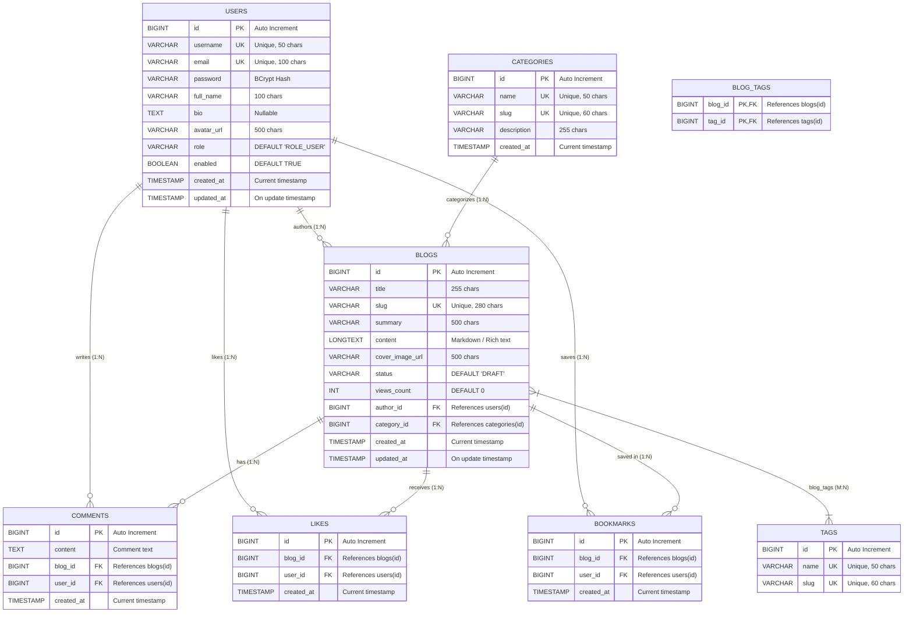

# 🗄️ Database Schema & Entity-Relationship (ER) Diagram

This document details the database design, tables, constraints, indices, and relationships for the **Blogging & Content Publishing Platform**.

---

## 📊 Entity-Relationship Diagram

---

## 📋 Table Specifications & Constraints

| Table Name | Description | Key Constraints | Foreign Keys |
|---|---|---|---|
| **`users`** | Stores user profiles and authentication data | `id` (PK), `username` (UK), `email` (UK) | None |
| **`categories`** | Organizes blogs into hierarchical topics | `id` (PK), `name` (UK), `slug` (UK) | None |
| **`blogs`** | Contains published & draft blog posts | `id` (PK), `slug` (UK) | `author_id` -> `users(id)` `category_id` -> `categories(id)` |
| **`tags`** | Keywords for article tagging and search | `id` (PK), `name` (UK), `slug` (UK) | None |
| **`blog_tags`** | Many-to-Many junction between blogs and tags | `(blog_id, tag_id)` (Composite PK) | `blog_id` -> `blogs(id)` `tag_id` -> `tags(id)` |
| **`comments`** | Reader comments on blog posts | `id` (PK) | `blog_id` -> `blogs(id)` `user_id` -> `users(id)` |
| **`likes`** | Unique user likes per blog post | `id` (PK), `(blog_id, user_id)` (UK) | `blog_id` -> `blogs(id)` `user_id` -> `users(id)` |
| **`bookmarks`** | Reading list bookmarks saved by users | `id` (PK), `(blog_id, user_id)` (UK) | `blog_id` -> `blogs(id)` `user_id` -> `users(id)` |

---

## ⚡ Performance Indices

- `idx_blogs_status`: Optimizes filtering by `PUBLISHED` vs `DRAFT` status.
- `idx_blogs_author`: Accelerates fetching articles authored by a specific user.
- `idx_blogs_category`: Speeds up category-based article listings.
- `idx_comments_blog`: Fast retrieval of comment threads on article pages.
